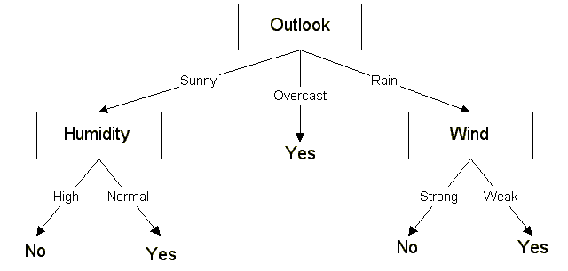
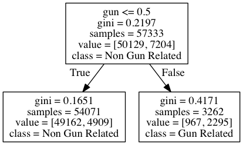

<!-- Check whether the assignment is up to date -->
{{'now' | date: '%Y'}}
{{page.due_date | date: '%Y'}}
 

Warning: this assignment is out of date.  It may still need to be updated for this year's class.  Check with your instructor before you start working on this assignment.


<!-- End of check whether the assignment is up to date -->

This assignment is due before class on {{ page.due_date | date: "%A, %B %-d, %Y" }}.

Training a classifier: Assignment 4 
=============================================================
If you watch the news, you have probably noticed that gun-related killings have become a standard part of the newscast, alongside weather and sports.  A lot of reserachers and concerned people (see [here](http://www.gunviolencearchive.org/), [here](http://www.theguardian.com/news/datablog/2012/jul/22/gun-homicides-ownership-world-list), and [here](http://www.fatalencounters.org/)) are interested in collecting data on the details of these shootings, following the zeitgeist that big data begets solutions.  This problem of finding and curating gun violence data is a great fit for crowdsourcing. It is too much work for one person to do alone, and too hard for computers to do automatically. This semester, our weekly homework assignments will work to build a large database of gun violence incidents across the country. 

As a preview of what is to come, your next assignments will cover the following steps in order to build a database:

* Train a machine learning classifier to recognize whether or not an article describes gun violence
* Crawl the web and download articles from local newspapers, and use your classifier to pull on the gun-related ones
* Recruit crowd workers to read the articles and pull out structured information (e.g. location, age of shooter)
* Determine workers' trustworthiness, and filter out data from unreliable workers
* Analyze the data in your database to understand and visualize trends in gun violence in the US
* Analyze the articles in your database to understand and visualize trends in how gun violence is reported

To start, we will be training a machine learning classifier. This is because, before anything else, our database will need articles about gun violence. Getting these articles is easier said than done. We *could* grab a handful of articles manually, but in order to build a meaningful database, we want to be able to gather data from a lot of articles, too many to do by hand. This is a picture perfect use of machine learning. If we can start with a small number of examples of gun-related articles and of non-gun-related articles, we can train a model to predict for a million or more articles, with hopefully reasonable accuracy, which articles describe gun violence and which do not. Plus, even if it is just [dressed-up statistics](http://en.wikipedia.org/wiki/Data_science#Criticism), getting to use sexy names like "data science" and "machine learning" will make your mother proud.

We have already collected training data for you. Chris crawled a [NY Times blog about gun violence](http://nocera.blogs.nytimes.com/category/gun-report/) and gathered about 9,000 articles describing gun-related crimes. (Next week, you will get to build a crawler yourself!) We are pulling examples of non-gun-related articles from a [local news corpus](ihttp://www.cs.jhu.edu/~anni/papers/alnc_lrec14.pdf) from Johns Hopkins.  In total you will have about 70K articles (~7 non-gun articles for every 1 gun article) to train your classifier. 
	
<h3>A bit about machine learning</h3>

Ahhhh, machine learning. Is there any way to make your grandparents more afraid of you then to tell them you work in machine learning? Working on anything related to "artificial intelligence" has the positive side effect that people will assume your work might any moment break down the door of your office and level the entire city of Philadelphia, enslaving all the humans in its path. But, honestly, in its current state, the robot apocalyse is looking like it will be lead by sentient beings that are [slow-driving](http://www.theguardian.com/technology/2015/nov/13/google-self-driving-car-pulled-over-driving-too-slowly), [upsettingly racist](http://blogs.wsj.com/digits/2015/07/01/google-mistakenly-tags-black-people-as-gorillas-showing-limits-of-algorithms/), and with a [fairly uptight sense of humor](http://www.emnlp2015.org/proceedings/EMNLP/pdf/EMNLP284.pdf). (So maybe the grandparents need not be too worried...)

This assignment should be a gentle introduction to machine learning, so don't worry if you've never been exposed to ML before. At its core, machine learning is the field of computer science concerned with algorithms that adapt by analyzing data.  A very simple case of machine learning is linear regression (the well-known *y = mx + b* you learned in middle school), where the you try to choose your parameters (*m* and *b*) in order to fit your data (*y* and *x*).  

When you hear people talking about machine learning classification (what we will be doing in this assignment), you will probably here them talking in terms of **features** and **labels**. "Labels" are simply the thing you want to train the model to predict. So, in our case, we want to know whether or not an article is about gun violence, so we will have two possible labels: "Gun violence" and "Not gun violence". 

"Features" refer generally to all of the things about the data that the computer will be able to use to make its prediction. Computers cannot simply read an article to decide if it is about guns. We, the engineers, need to break down the article into numerical values (or "features") that it can understand. We can imagine a lot of features about an article, some of which might be good for determining if the article is about guns, and others which will not be very good. E.g. the *length of the article* might be one feature, but probably not very related to gun-violence-ness. Another feature might be *whether or not the article contains the word 'gun'*, which is more likely to be useful to the classifier. In this assignment, you will look more closely at some types of features that can be used to represent an article in a useful way for the computer, and some different algorithms for using these features to make predictions.

##To Do

Your task will be to build a classifier following our guidelines, and [respond to some questions about the process](https://docs.google.com/forms/d/1YOCm-XTw3-BFGD2tr6YwCcyxQpzd0uGcYAdxTu4iQ54/viewform?usp=send_form). After that, you are free to experiment. We have held out some secret data that we will use to test your classifiers. The student/s with the best performing classifier will be given $1,000,000! Or extra credit. Probably extra credit.

1. [Download the data](assignments/downloads/articles.gz) and unzip it with the Unix <code>gunzip</code> command. The data is in the format of one article per line. Each line has two values (tab separated): a label (0 for non-gun, 1 for gun), and the text of the article. 

2. [Download the code template](assignments/downloads/classifier_template.py) and look through the function stumps. These steps should seem familiar if you think back to Wednesday's lecture. Look especially closely at the functions flagged with "TODO." These are the ones you will edit.

	<h3>Rule Based Classifiers</h3>

3. The simplest way to build a classification algorithm is to use a rule based system. Look at the function rule_based_classifier(). This function doesn't bother itself with mathy mumbo jumbo, it just looks for keywords it thinks are indicative of gun-related articles. (Here, our features are single words.) If one of the keywords appears, it predicts "1" (or "gun-related") and otherwise it picks "0". Right now we use just one keyword, "gun". Try running the code with this command and see how well this very simple method works.
	
	<pre><code> python classifier_template.py articles </code></pre>

4. Now, experiment with adding a few more keywords. See how high you can make the accuracy using this method. Experiment with combinations of keywords as well. Feel free to get creative with your conditional statements! (E.g. maybe it makes sense only to predict "gun-related" if the article contains "shooting" but not "basketball"?) You will answer a few questions about this in the questionnaire. 

	<h3>Decision Trees</h3>

5. Playing guess-and-check with "if 'shooting' but not 'basketball' or `guns' but not 'roses' then predict 1...", it could take the rest of your life to build an efficient and accurate classifier. This isn't because the "if/else" method using keywords is inherently bad, it is actually quite good, but there are so many words to check, and every time you branch, the number of cases grows exponentially! Luckily, computers. Next, let's look at a more algorithmic approach to creating a classifier: Decision Trees. Decision Trees are a class of Machine Learning algorithms that use a tree-like structure to model certain decisions and map them to their corresponding outcomes. The image below is a very simple example of a decision tree classifier for predicting the weather. In short, a Decision Tree systematically looks at all the features you provide it, and determines whether or not to create a branching node based on this feature's value. E.g. in the DT below, the feature "Outlook" was chosen as the first node, and it has the possible values Sunny, Overcast and Rain. The tree is recursively built using this process until either 1) the classification at each of the leaf nodes is perfect, 2) we run out of features, 3) the tree is getting enormous and we decide to stop. If you are interested in learning more about Decision Trees, read [this chapter](http://www.cs.princeton.edu/courses/archive/spr07/cos424/papers/mitchell-dectrees.pdf) and look into the courses [CIS 419/519](http://www.cis.upenn.edu/~cis519/fall2015/) and [CIS 520](https://alliance.seas.upenn.edu/~cis520/wiki/).  We won't obsess over the math in this class, but suffice it to say, DTs are surprisingly good at classification tasks (much like this one!). 

	

6. The rule based classifier you created using conditional statements in the function <code> rule_based_classifier()</code> was essentially a Decision Tree. Draw the Rule Based Decision Tree you came up with in part 3 using your favourite diagram-making tool. (I like [draw.io](https://www.draw.io/))

6. Let's now create an actual decision tree. You will need the [Graphviz](http://www.graphviz.org/) library installed for this to work as well as the most up to date version of the [Scikit-Learn Machine Learning package](http://scikit-learn.org/stable/). To make sure they're installed and upto date, run the following two commands:

	<pre><code> pip install graphviz
	pip install -U scikit-learn </code></pre>

7. Uncomment the 3 lines in the Decision Tree section and run the script. The code takes a couple seconds to run. The Decision Tree diagram generated is shown below.

	

	This dummy tree (sometimes called a "decision stump") classifies every article using only one feature: the word "gun". Each box contains a couple values: 

	* **gun <= 0.5** -- This tells us the feature ("gun"). The left brach corresponse to the value of "gun" being less than 0.5 and the right corresponse to the value being more than 0.5. Because our data is binary, this is exactly the same as "gun" being 0 or 1. 
	* **gini** -- This is the [Gini Coefficient](https://en.wikipedia.org/wiki/Gini_coefficient), a statistical measure of uncertainty. A lower Gini index corresponds to a more uniform dataset, and the more certain we are that our prediction at this point will be correct.
	* **samples** -- This is the total number of instances falling under this classification of the tree. As we're looking at the root node, "Samples" equals the entire dataset of 57,333 entities. 
	* **value** -- This shows us the classification split i.e. at the root node we have 50,129 non Gun Violence related articles and 7204 Gun violence related articles. 
	* **class** -- this is the dominant classification at this stage. In other words, this is the label the Decision Tree would assign to our instance if the decision process terminated at the given node. This detail is unimportant for internal nodes but crucial for leaf nodes, which assign the final classification.
	

8. Now look at <code>get_dtree_features()</code> and add the features you used in your Rule Based Classifier from part 2. Re-run the script and look at the generated Decision Tree. Compare it to the Decision Tree you drew. What are the similarities and differences? Did your accuracy improve? You will later note these observations in the questionnaire.

9. Decision Trees are a very powerful classification tool but are prone to [overfitting](https://en.wikipedia.org/wiki/Overfitting). Play around with the code and add more keywords. You'll find your accuracy begins to decline after a certain point. One way to avoid this is limiting the height of the tree. This can be done using the <code>max_depth</code> attribute. Replace the <code>None</code> with an integer value (try a couple different values). 

	<pre><code>  clf = DecisionTreeClassifier(max_depth=None)</code></pre>

	Change both the keywords and the tree height and see how accurate you can make your classifier. You will submit the tree diagram output of your most accurate Decision Tree.

	

	

	<i>Extra Credit</i>
	

	

		Take your optimized Decision Tree and reverse engineer it to create a Rule Based Classifier. Complete the function <code>extra_credit_classifier()</code> to do this. How does the accuracy of this classifier relate with that of your optimized Decision Tree? 

	

	

	<h3>Statistical Models</h3>
8. You can get surprisingly far using just a few keywords. But why stop there? Why not use ALL THE KEYWORDS!? That is precisely what statistical models are for! 

	For the statistical model, your code will really just need to do one thing. That is, you need to build two side-by-side data structures: a *feature matrix* and a *label vector*. Your feature matrix will represent one article on each row, and each column will correspond to some "feature" you can observe about that article. The label vector will give the correct labels of each article, so that the nth element of the vector is 1 if the nth row of the matrix corresponse to a gun-related article.
	
	Look at the function get_features(). The template builds a stupid classifier whose feature matrix contains only one feature, which has the same value for every article. Try running it as follows and see that you get the below output. Here, the classifier is trying to make predictions, but has absolutely no information to work with. As a result, it just guesses based on the [prior probability](http://en.wikipedia.org/wiki/Prior_probability). I.e. this accuracy is the result of the classifier chosing the label "0" (or "non-gun-related") for every article.

	<pre><code> $ python classifier.py articles.txt 
	Fold 0 : 0.87449
	Fold 1 : 0.87624
	Fold 2 : 0.87687
	Fold 3 : 0.87456
	Fold 4 : 0.87526
	Test Average : 0.87548 </code></pre>

	Using your well-honed word-counting skills from bootcamp, try rewriting get_features() so that, for each article, the features are simply all of the words which are in that article. E.g. for the sentence "That guy shot that other guy," you will want a feature dictionary that looks like

	<pre><code> {'That' : 1, 'guy' : 2, 'shot' : 1, 'that' : 1, 'other' : 1}</code></pre>
	
	This is what is referred to in NLP as a "unigram features." 

	Try it and then record your experience in the [questionnarie](https://docs.google.com/forms/d/1YOCm-XTw3-BFGD2tr6YwCcyxQpzd0uGcYAdxTu4iQ54/viewform?usp=send_form). For your classifier analysis, you need to look at feature weights that have been learned, and will need to see the predictions the classifier makes for individual articles. Look at the [functions available to you](http://scikit-learn.org/stable/modules/generated/sklearn.linear_model.LogisticRegression.html) through the LogisiticRegression classifier to get you started. 

And with that- Good luck! Start early and have fun! If robots are going to run the world, they need to first know the difference between articles about gun violence and articles about the weather. So go! Make it happen! 

Don't forget to answer all of the questions in the [questionnaire](https://docs.google.com/forms/d/1YOCm-XTw3-BFGD2tr6YwCcyxQpzd0uGcYAdxTu4iQ54/viewform?usp=send_form) when you are done, and to submit your final classifier code, a picture of the tree you drew and the generated diagram of your optimal Decision Tree via turnin. You will need to put all of the files in one directory and submit the entire directory at once, like below. Please do **not** submit your articles.gz files! Only submit your code, and the two decision tree png files.

<pre><code> $ mkdir assignment4 # make a directory
 $ mv classifier.py rule-based-tree.png decision-tree.png assignment4 # move all of your files into that directory
 $ turnin -c nets213 -p classifier -v assignment4/* # submit the whole directory
</code></pre>

Your code and questions are due <b>{{ page.due_date | date: "%A, %B %-d, %Y" }}</b>. You can work in pairs on this assignment.  You must declare the fact that you are working together when you turn in the questionnaire.  If you are working with a partner, only one of you needs to turn in the code, but you must specify who will be turning it in on the questionnaire. You cannot add or change partners after the code and questionnaire are submitted.

#### Grading Rubric

This assignment is worth 5 points of your overall grade in the course.  The rubric for the assignment is given below.

* 1 points - Create a rule based classifier
* 1 points - Create a decision tree and a decision tree diagram
* 1 points - Implement a statistical unigram model
* 2 points - Answer the survey questions
* Extra credit (1 point) - Reverse engineer the optimal decision tree as a rule based classifier.

Related Projects
================

* [Gun Violence Archive](http://gunviolencearchive.org)
* [Mass Shooting Tracker](http://shootingtracker.com/wiki/Main_Page)
* [Uniform Crime Reporting Statistics](http://www.ucrdatatool.gov/Search/Crime/State/StatebyState.cfm)
* [Police-shooting Database](http://regressing.deadspin.com/deadspin-police-shooting-database-update-were-still-go-1627414202) 
- [Gawker article](http://gawker.com/what-ive-learned-from-two-years-collecting-data-on-poli-1625472836), [NPR story](http://www.npr.org/2014/08/21/342228794/ferguson-turns-lens-on-police-involved-killings-but-some-facts-are-few)
* [Fatal Encounters](http://www.fatalencounters.org)
* [Rates of gun homicides by country compiled by The Guardian](http://www.theguardian.com/news/datablog/2012/jul/22/gun-homicides-ownership-world-list)
* [USA TODAY research reveals flaws in mass-killing data](http://www.usatoday.com/story/news/nation/2013/12/03/fbi-mass-killing-data-inaccurate/3666953/)
* [Why The Ban On Gun Violence Research Is A Public Health Issue](http://www.huffingtonpost.com/entry/dickey-amendment-gun-violence-research-ban_us_56606201e4b072e9d1c4eaaa)

