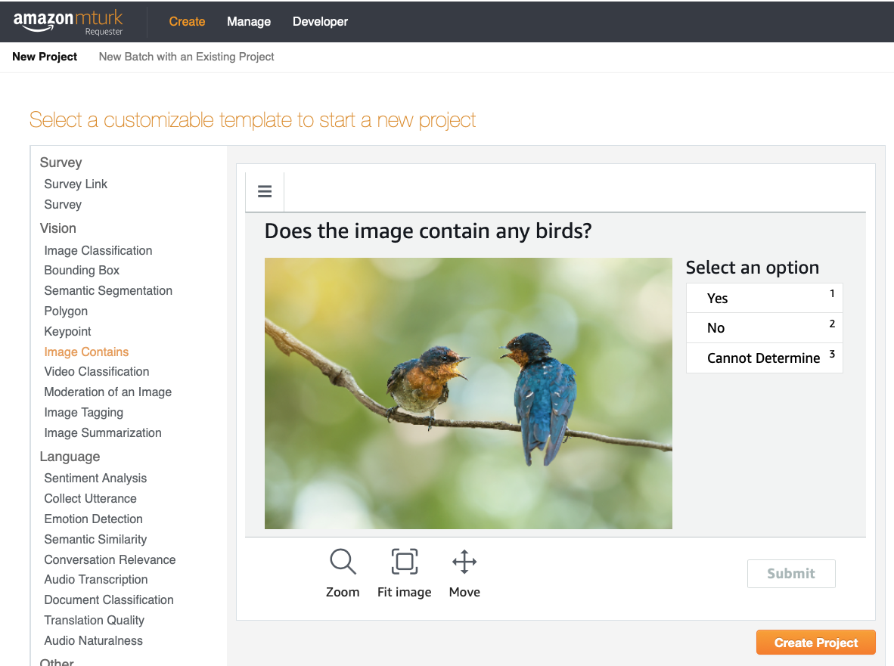
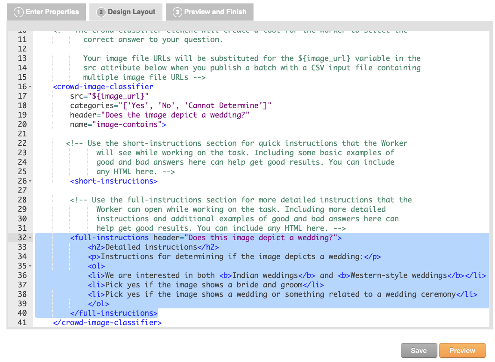
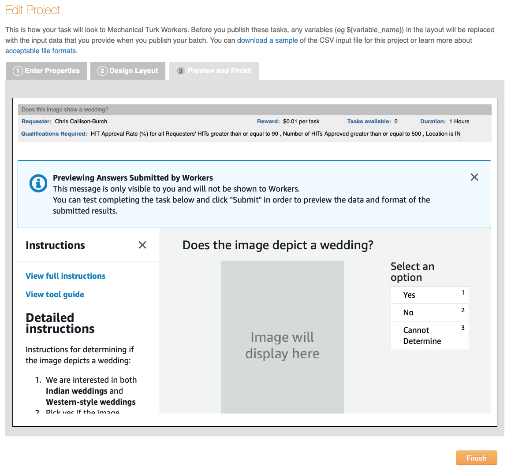
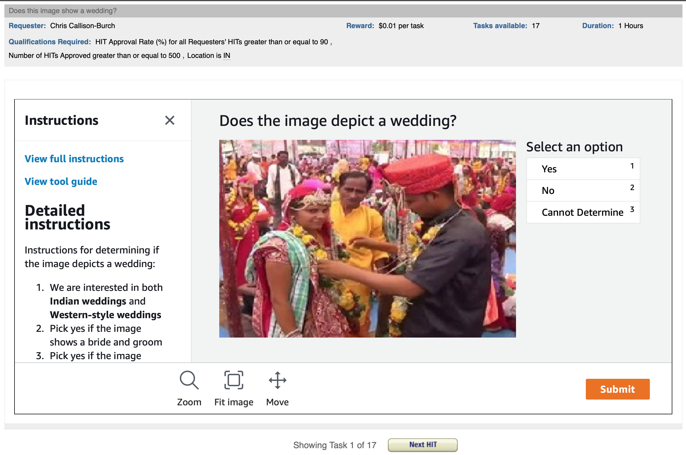

<!-- Check whether the assignment is up to date -->
{{'now' | date: '%Y'}}
{{page.due_date | date: '%Y'}}
 
<div class="alert alert-danger">
Warning: this assignment is out of date.  It may still need to be updated for this year's class.  Check with your instructor before you start working on this assignment.
</div>

<!-- End of check whether the assignment is up to date -->


<div class="alert alert-info">
This assignment is before {{ page.due_date | date: "%I:%M%p" }} due on {{ page.due_date | date: "%A, %B %-d, %Y" }}. 
</div>


Become a Requester<span class="text-muted"> : Assignment 5</span> 
=============================================================

In this homework assignment, you're going to learn how to be a [requester on Amazon Mechanical Turk](https://requester.mturk.com/).  You should try to sign-up as a requester as soon as possible, because it is a multi-step process and each step can take time.  If you're unable to sign up as a requester yourself, we recommend partnering with another student who has successfully signed up. You will work in pairs.

Once you are a requester, you will be able to post work on MTurk and to pay workers to complete your tasks.  To complete the work outlined in this assignment, you need to pay about $25.  If paying $25 of your own money presents a financial hardship to you, then please email your professor.

We will be asking workers to label images for us, similar to how [Fei-Fei Li created ImageNet](https://qz.com/1034972/the-data-that-changed-the-direction-of-ai-research-and-possibly-the-world/).

## Your first HIT

Let's get started with creating your first HIT on MTurk.   After logging into your requester account, go to the Create Tab and then click [New Project](](https://requester.mturk.com/create/projects/new)).  We'll be labeling images, so you can start with the built-in Image Contains  HIT design (shown below).



Select Image Classification, and then click on Create Project.  You will see 3 tabs: 
* **Enter Properties** is where you can configure how much you will pay workers to do your task (Reward per assignment), how many workers you want to annotate each item (Number of assignments per task), and who is allowed to work on your your tasks (Worker requirements).
* **Design Layout** is where you can edit the HTML that forms your HIT.  You can update the instructions,  add new html form elements to collect input from workers, and modify the variable names (denoted as ${variable_name}).
* **Preview and Finish** is where you see how your task will look to workers.  When you publish your tasks, any variables in the layout will be replaced with the input data that you provide via a comma separated value (CSV) file.  You haven't uploaded any data yet, so you won't see it in the preview.

In the **Enter Properties** tab, you should change the following fields:
* Project Name - this is a mneumonic name for yourself.  I named mine "Image labeling version 1".
* Title - this is what the workers will see in the on the HIT Groups listing on [worker.mturk.com](https://worker.mturk.com).  We're going to be having workers label wedding photos, so I changed this field to say "Does this image show a wedding?".
* Description - this is what a worker sees once they click on your HIT title.  I changed this field to say "Does this image depict a wedding?  We are interested in both Indian weddings and Western-style weddings."
* Keywords - workers can search for tasks based on this.  In addition to *image*, and *classification*, I added *wedding*.
* Reward per assignment - this is how much you'll pay a worker to do one task.  It doesn't include Amazon's commission. I set this at $0.01.
* Number of assignments per task - this is how many workers you want to label each item.  I set this at 3 so that we can take a majortiy vote in cases where workers disagree about what the correct answer should be.


In the **Worker requirements** section of the **Enter Properties** tab, I added several qualifications that workers had to meet in order to do my task:
* HIT Approval Rate >= 90%
* Number of HITs approved >= 500
* Location is India (since we'll be labeling a lot of photos related to Indian weddings)


In the **Design Layout** tab, edit the HTML to say that we're looking for pictures of weddings instead of birds, and edit the Detailed Instructions section to give clearer instructions on what we're looking for.  Here's what I wrote: 

*Instructions for determining if the image depicts a wedding:*
* *We are interested in both Indian weddings and Western-style weddings*
* *Pick yes if the image shows a bride and groom*
* *Pick yes if the image shows a wedding or something related to a wedding ceremony*




After you've made those edits, you can click on Save and then Preview to see what your HIT will look like to workers.   Since you haven't yet uploaded any information (like the URLs for the images that you want users to judge), there will be a placeholder saying "Image will display here".  



If you're satisfied with how the HIT looks, you can click the Finish button.  You'll then see your newly created task listed with a big orange button saying "Publish Batch" next to it.  You can publish a batch by clicking that button and uploading a comma separated value (CSV) file with the inputs to the HIT.  The popup screen that appears will give you a link to download a sample .csv file that shows what fields you need for your HIT.  For this HIT design, all we need is a single column with the header *image_url*, and a list of the image URLs that we want workers to judge.  Here's a [small CSV file](assignments/downloads/wedding-photos-small.csv) that you can use to test your HIT.


Once you've uploaded the CSV then you can preview the HITs with the data populating them. There's a "Next HIT" button that will let you click through and preview multiple assignments.  This is useful to check things like whether your image links are all working properly.  




If you're happy with how the HITs look, you can click the big orange "Next" button.  You'll then see a summary screen that gives details about the HIT including how much it will cost.  You can then publish your task for Turkers to work on by clicking on the big orange "Publish" button.


Your HITs will be posted to MTurk.  Once work has begun, you can mointor progress in the [Manage tab](https://requester.mturk.com/manage). You'll see a green progress bar showing how many of them have been completed. 


You can see the individual responses by clicking on the "Review Results" link above the progress bar.  On this screen you'll see:
* The HIT ID - notice that there are 3 HIT IDs that are all identical, since we asked 3 workers to annotate each item. 
* The Worker ID of the workers who completed each HIT.
* The Approval Rate for the worker - this is how many of the worker's tasks we have approved in the past (not how many all requesters have approved - just us).
* Input.Image Url - the input field in the CSV that we uploaded.
* Image Contains.Label - the label that the worker picked.


You can see that the three workers all said that the first URL did not show a wedding.  This is the image that they said doesn't show a wedding:


Three workers said that the second URL did show a wedding.  This is the image that does show a wedding:


The Review Results screen will also let you approve or reject the Workers' submissions.  I recommend going ahead and approving all the assignments for this test HIT.
You can also Download all of these results in a CSV file.  Here is the [results file](assignments/downloads/wedding-photos-small-Batch_3537650_batch_results.csv) from when I ran the HIT.   You can open the CSV file in a spreadsheet app.  You'll notice that the CSV file has a lot of extra fields that include information about your HIT, including the properties that you included for it, and info about the amount of time that workers took to complete each assignment.  Columns in the results CSV that start with "Input." are the variables that were in the CSV that you uploaded.  Columns that start with "Answer." are the answers that the Turkers provided.


## Why are we labeling images of Indian weddings?

Last week, you trained an image classifier with modern machine learning methods to achieve state-of-the-art results, making use of _transfer learning_ from the ImageNet dataset, which was [collected with large-scale crowdsourcing](http://image-net.org/tutorials/cvpr2015/crowdsourcing_slides.pdf). 

[AI encodes and magnifies bias](https://www.fast.ai/2019/01/29/five-scary-things/#bias), and [Google researchers](https://ai.google/research/pubs/pub46553) found that ImageNet and another popular dataset called Open Images "appear to exhibit an observable amerocentric and eurocentric representation bias," as demonstrated by the distribution of geographically identifiable images in the datasets, with 2/3 of the images from the Western world.


In addition, classifiers trained on the datasets show "strong differences in the relative performance on images from different locales", with lower accuracy and confidence on images with labels related to people, like "bridegroom" and "police officer", from countries like India and China. The research helped inspire the [Inclusive Images Challenge](https://ai.googleblog.com/2018/09/introducing-inclusive-images-competition.html), run by Google in partnership with a top deep learning conference called NeurIPS, last year.


A different large-scale crowdsourced dataset, [The Massively Multilingual Image Dataset (MMID)](http://multilingual-images.org/), was created by Penn researchers to learn English translations for words in 100 foreign languages, by scraping images for each foreign word and finding the English words that had the most "similar" images.


MMID contains around 100 images for around 10,000 words in 100 foreign languages, providing an interesting source of data for improving the "geodiversity" of image classifiers. However, [the images for an English translation of a foreign word can be noisy](http://aclweb.org/anthology/P18-1239), as shown by crowdworkers who evaluated the relevance of images for a large subset of translations in 3 languages.

In this assignment, you will explore how a classifier pre-trained on ImageNet performs on photos representing wedding-related words in several Indian languages, and employ Indian workers on Mechanical Turk to validate that images are in fact related to "groom/bridegroom". You should work in teams of 2.

<div class="panel panel-info">
<div class="panel-heading" markdown="1">
#### Detailed Instructions
</div>
<div class="panel-body" markdown="1">

1. In a Colab notebook with a GPU runtime **(Runtime -> Change runtime type -> Hardware accelarator -> GPU)**, follow the Keras code to [Classify ImageNet classes with ResNet50](https://keras.io/applications/#classify-imagenet-classes-with-resnet50) on a wedding image you download from Google Images and upload to Colab, to get a feel for the code. Keras is a high-level neural networks library that makes it easy to run pre-trained models.

2. Upload the [zipped "Weddings Indian Languages" dataset](https://drive.google.com/file/d/1ElHME-VAHg2NUJKQuD5uaQQ-fCgMrWBi/view?usp=sharing) to Colab and run `!unzip "weddings-indian-languages.zip"` in a new cell. The dataset is composed of around 200-1000 images per language, for 8 languages spoken in India (Bengali, Gujarati, Hindi, Malayalam, Marathi, Punjabi, Tamil, and Telugu), taken from MMID. Repeat with [the "Weddings European Language" dataset](https://drive.google.com/open?id=1QCbzBHfXchwCbHZs2wUceUHcz8GM1S2L), which includes Spanish.

3. Create a [Pandas DataFrame](https://colab.research.google.com/drive/1aASE_EiwZTT18ktR7uaLMWbMI30QXdk5) from a list of dictionaries, where each dictionary contains the results of the classifier on an image, and looks like this.

```
{"path": "weddings-indian-languages/hindi/6250/07.jpg",
"predictions": ["vestment", "kimono", "theater_curtain"],
"predictions_include_groom_or_bridegroom": False}
```

We recommend using the [glob module](https://docs.python.org/3/library/glob.html) with the appropriate wildcards to get a list of all the images. Save the DataFrame as `image_paths_and_predictions.csv`, which you will use later in the assignment. To simplify step 7, **you must add "https://s3.amazonaws.com/nets213-hw5/" to the beginning of each image file path**, before saving the DataFrame as a CSV.

6. Use the [provided design layout](https://drive.google.com/file/d/1PHipJaHMhPPImSk-SJ8JKSdmhOLLgwnA/view?usp=sharing) to create the HIT. Download a sample of the input CSV file for the project at the top of the preview page, and finish creating the HIT.

7. Use the sample `input.csv` file format and data from `image_paths_and_predictions.csv` (created in step 3, which you can load in as a DataFrame) to create `variables.csv` with the right format for this HIT. The English word we care about is "groom/bridegroom".

8. Click "Publish Batch" in MTurk, uploading `variables.csv`, and preview the tasks. Click "Next" and confirm the settings of your HIT, which should cost approximately $25 per team. **Make sure to screenshot this page for the report**. Sit back and watch the crowd work!

9. When the HIT is done, download the Batch CSV and read it into a DataFrame in Colab. For every row in the DataFrame, split "Answer.selected" to get the list of images that workers identified as "groom/bridegroom". For each image in the row (in columns "Input.image<number>"), if image<number> is in the selected images, update a counter, where the key is the URL in the "Input.image<number>" column. Here is the pseudocode:
  
```
Create a Counter object counts
For every row in the DataFrame:
     true_images = the list of images from splitting the string in the "Answer.selected" column of the row
     for every column "Input.image<number>":
          if image<number> is in true_images:
               url = row["Input.image<number>"]
               counts[url] += 1
```
  
10. Create a DataFrame from the resulting counter, and derive a new column that is True only if the counter value is 2 or more (a majority of the workers said the image represented "bride/bridegroom"). Use the merge function to join the DataFrame loaded from `image_paths_and_predictions.csv` to the DataFrame of true labels, on the column of image paths. Save the DataFrame as `submissions.csv`. Calculate the precision, recall, and F1 score of the classifier. Are you surprised by the results you got? Analyze the predictions and "true labels" further by visualizing images that the classifier (in)correctly labeled.

</div>
</div>

<div class="panel panel-primary" id="questions">
<div class="panel-heading" markdown="1">
#### Report
</div>
<div class="panel-body" markdown="1">

Below are the questions that you will be asked to answer about this assignment. Please turn in your answers in a PDF for [Homework 5 on Gradescope]({{page.submission_link}}).

1. What is the link to your Colab notebook?
2. Attach a screenshot of the page confirming the settings of your HIT.
3. What is the precision, recall, and F1 score of the classifier?
4. Analyze how the predictions of the classifier compare to the labels of the workers. Include images to explain why you think the classifier correctly or incorrectly labeled certain images.
5. If you had more time to work on this HIT, what additional things would you add in the creation or processing of the HIT for better quality control and aggregation?
6. Upload `submissions.csv`.
</div>
</div>
