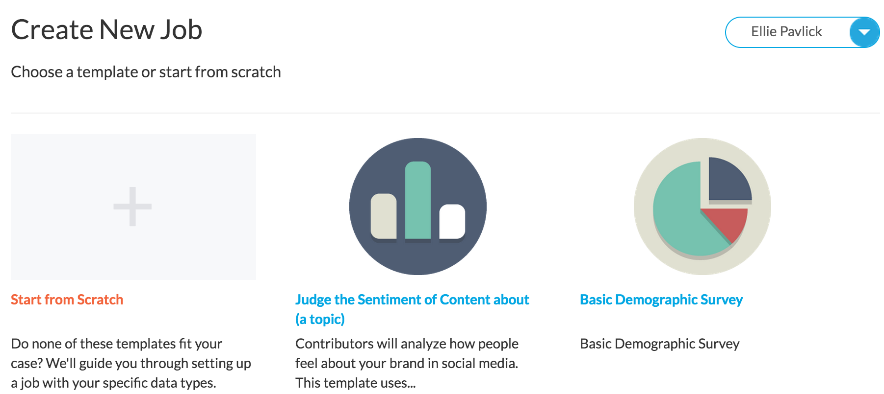
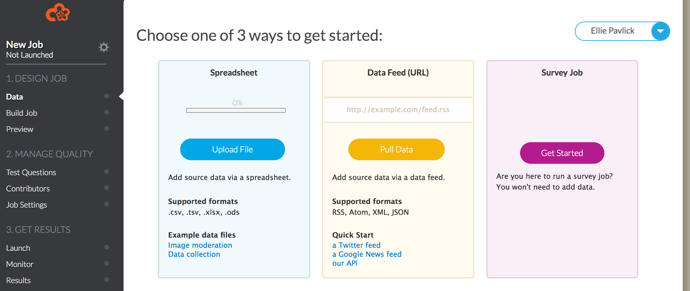
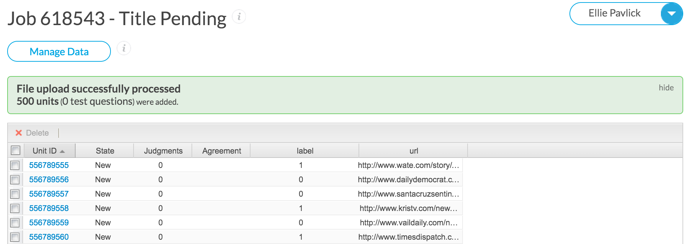
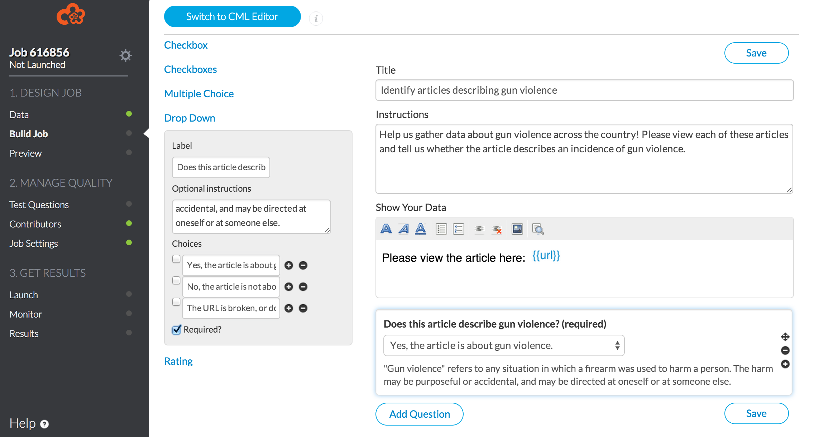
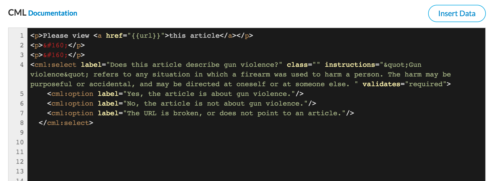
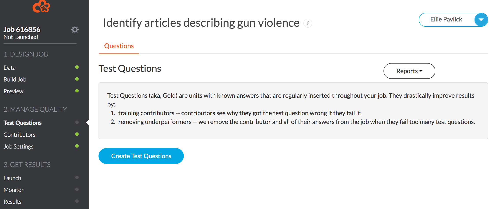
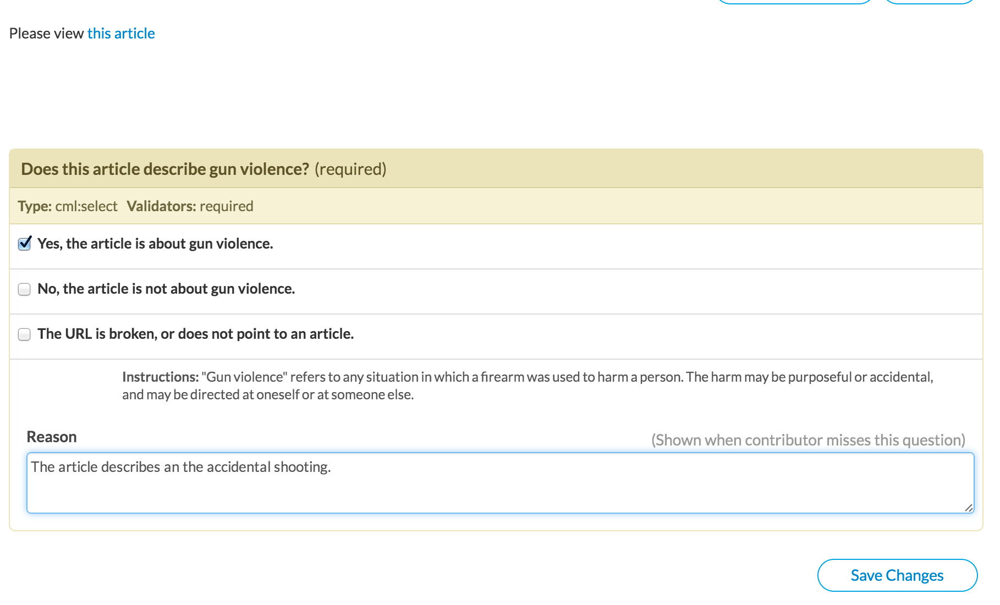
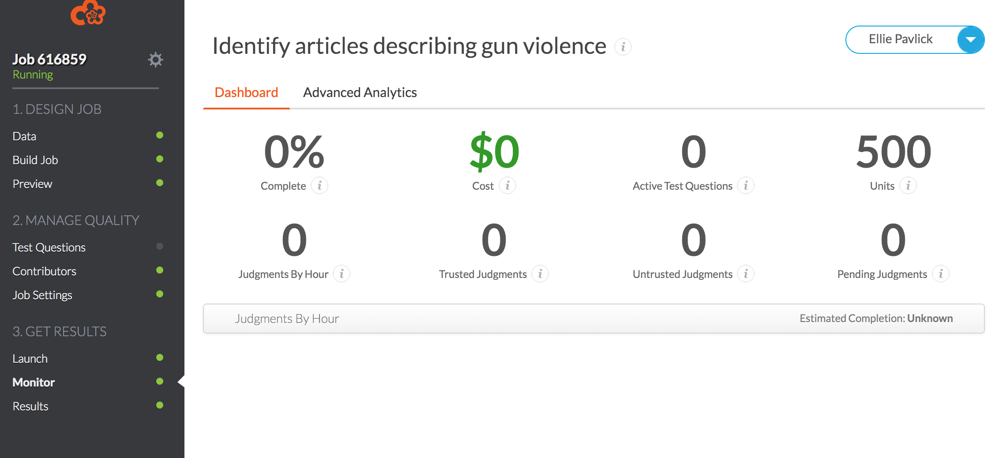
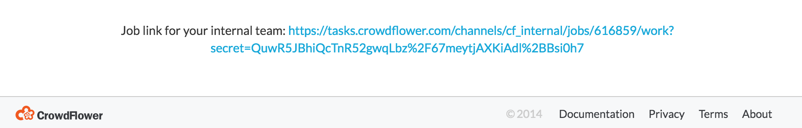

<!-- Check whether the assignment is up to date -->
{{'now' | date: '%Y'}}
{{page.due_date | date: '%Y'}}
 

Warning: this assignment is out of date.  It may still need to be updated for this year's class.  Check with your instructor before you start working on this assignment.


<!-- End of check whether the assignment is up to date -->

This assignment is due on {{ page.due_date | date: "%A, %B %-d, %Y" }}. 

Become a Requester : Assignment 5 
=============================================================

Last week, you built a classifier to predict whether or not an article was about gun violence. You were able to estimate how well your classifier did by using [cross validation](http://en.wikipedia.org/wiki/Cross-validation_(statistics)), and you probably ended up with some accuracies that were pretty damn near perfect. But why train a model to label articles that already have labels?  The real point of machine learning is not to predict things that you already have answers to, but to try to predict new things. This week, we want to see if our classifier can look at new articles that no one has labeled, and predict whether or not they are about guns. 

Predicting on data "in the wild" is much harder than predicting on the training data. There are a million reasons for this. To name a few:

* Your training data contained 10% gun-related articles. If you download all the articles posted on a given day, it is probably not the case (let's hope to God!) that 10% of them describe gun violence. So you are now looking for a tiny needle in a huge haystack, whereas your classifier is expecting something very different.  
* Your training data was nicely cleaned and contained sentences like: <i>"After a 14-year-old was gunned down Thursday night it appears Chicago went 42 hours without a shooting."</i> Scraping articles from the web can yield senences like this beauty: <i>"Boy, 3, among 13 injured in Chicago park shooting .zone Boy, 3, among 13 injured in Chicago park shooting #adgSocialTools #adgSocialTools div.social_header #adgSocialTools div.social_main #adgSocialTools div.social_main img, #adgSocialTools div.social_footer img #adgSocialTools div.social_footer #adgSocialTools div.social_footer..."</i>

You can probably imagine that that 99% accuracy on cross validation may have been misleading. So this week we will get a real estimate of how well your classifier can do by taking the articles that your classifier thinks are gun-related, and asking workers on Crowdflower whether they agree or disagree with these predictions.

This assignment has three parts:

1. You will need to build a crawler to collect news articles from the web. Some of these will hopefully be about gun violence, but many will not. 
2. You will need to run your classifier from last week on your crawled articles, and pull out the articles that the classifier thinks are related to guns.
3. You will create a task on [Crowdflower](http://www.crowdflower.com/) to have workers assess your predictions. You will use their labels to recalculate your classifier's accuracy.

**Extra Credit**: We will run a little competition on the assignment for extra credit. The task is simple: whoever can deliver the largest list of urls to actual, gun-violence articles will get extra credit, and much loving praise. This can mean you build a super-accurate classifier, or a super effective crawler, or both. We will describe the details of the competition at the end of the assignment. 

**Note:** We recommend using your account on biglab for this assignment. Depending on how successful you are in Part 1, you might end up with large numbers of files to process. The biglab machines have more memory than eniac (and I assume more than your laptop...) and will save you from running into memory issues (which can result in tragic situations, like not being able to watch netflix while your code runs...). You can use ssh to access your account on biglab like below. 

	$ ssh epavlick@biglab.seas.upenn.edu
	epavlick@biglab.seas.upenn.edu's password: 
	SEAS SuSE Linux 13.1
	$ mkdir assignment5 # make a directory to work in
	$ cd assignment5 # go into that directory and being working

<h3>Part 1: Pub(lication) Crawl</h3>

Part 1 of your assignment is to build a web crawler! This is up there as one of the most important life skills you will ever learn, alongside balancing a budget and feeding yourself. And like most essential life skills, you don't need to be great at building a web crawler, you just need to know enough to get by. This section of the assignment will introduce two tools for collecting urls from the web, and walk you through running the templates we provide. Then, we will ask you to extend and improve what we show you in order to collect as many gun-violence article urls as you can.

1. **Download the code** First things first: download the [code templates](http://crowdsourcing-class.org/assignments/downloads/assignment5.tgz) for this assignment. When you unpack the archive, you should see the directories shown below. (Note that if you experience problems with wget, you can always just click the link and download the file to whichever folder you plan to work from.)  
	
	<pre><code> $ wget http://crowdsourcing-class.org/assignments/downloads/assignment5.tgz
	$ tar -xzvf asssignment5.tgz 
	$ ls assignment5	
	part_1_crawling part_2_classification</code></pre>

2. **Read through python_crawler.py** We will first deal with the code in part_1_crawling. You should see that this directory contains three files, like below. Open the file called python_crawler.py and read through the code and comments. You don't need to understand every line (TBH, I copy and paste code from the internet all the time without understanding it) but you should have an idea of what is happening, since you will need to modify it later. 

	<pre><code> $ ls assignment5/part_1_crawler/
	bing_api.py  get_clean_text.py  python_crawler.py </code></pre>

3. **Use Python to crawl Gun Report blog** At a high level, the code in python_crawler.py is a basic web crawler. It will begin on a webpage that we specify, and it will look for all of the hyperlinks on that page. Everytime it finds a link, it will print the link, and then follow it. When if follows a link, it will start doing the exact same thing-- looking for more links, printing them, and then following them. For people who have taken algorithms, you will recognize this as a standard [depth-first search](https://en.wikipedia.org/wiki/Depth-first_search). For those of you who haven't, you will recognize this as a perfectly common sense way to look for links, regardless of fancy names. The code written now scrapes links from the [Gun Report Blog](http://nocera.blogs.nytimes.com/category/gun-report/). This is the same site Chris used to collect training data for your assignment last week. Try running the code, and see what output you get. The below commands will run the crawler and print the links to a file called gun_report_urls.txt. The second two lines will remove duplicated urls in your list. Note this crawler is not very fast. For me, running the code took about 10 minutes and produced 8,868 unique urls.

	<pre><code> $ python python_crawler.py > gun_report_urls.txt
	$ cat gun_report_urls.txt | sort | uniq > tmp #remove duplicate urls and put all the unique ones in tmp
	$ mv tmp gun_report_urls.txt # replace the old list of urls with the new list of only unique urls
	$ wc -l gun_report_urls.txt # print the number of lines in the file.
	8868 </code></pre>

4. **Modify python_crawler.py** You should now modify the code in python_crawler.py in order to crawl the [Gun Violence Archive](http://www.gunviolencearchive.org/last-72-hours?page=1) website. You should save the urls you collect to a file called gun_archive_urls.txt, and submit this file when you turnin your assignment.

5. **Sign up to access the Bing API** Crawling websites like we did above is a common way to collect data from the web. Another very common way is through the use of APIs. Here, we will show you how to use the Bing search API. In short, and API allows your program to issue web queries in much the same way you do when you use a browser. To use the Bing API, you will need to register with Microsoft [here](https://datamarket.azure.com/dataset/bing/search) (sign up for the free account). Once you are registered, search Microsoft Azure Marketplace for "Bing Search API". Subscribe to the 5,000 transactions a month plan which is free. Then go to **My Account** > **My Data** and click on the **Use** link next to **Bing Search API**. This will redirect you to a page with Bing Search API at the top with fields for Source and Query. You can play with issuing different search queries in the browser here if you want. But, mainly, you will need to click **Show** next to **Primary Account Key**, which is at the top of the page just to the right of the logo, and copy and paste your key into the bing_api.py script where it says YOUR KEY HERE.

6. **Use the Bing API to collect urls** Like before, read through the code in bing_api.py and try to understand what is happening. Again, you will need to modify it, so familiarize yourself with the url request structure, and the parameters that you are passing. You can run the code similarly to before, as follows:

	<pre><code> $ python bing_api.py > bing_urls.txt
	$ cat bing_urls.txt | sort | uniq > tmp #remove duplicate urls and put all the unique ones in tmp
	$ mv tmp bing_urls.txt # replace the old list of urls with the new list of only unique urls
	$ wc -l bing_urls.txt # print the number of lines in the file.
	140 </code></pre>

7. **Modify bing_api.py** Now, edit the bing_api.py file in two ways. First, try at least three different queries, and output the results of each one. Second, change the printing to print not just the url, but also the title and date associated with the article. Your script should print the three fields (url/date/title) separated by tabs. You should print the output to a file called bing_api_results.txt, and submit this file when you turn in your assignment.

8. **Go forth and do** At this point, you have a lot of tools at your disposal to collect urls and articles. You should try to collect as many as possible. At a minimum, **you are required to submit at a list of least 2,500 urls**. These urls must include those that you collect from the Gun Violence Archive in Step 4, and the Bing API urls you collect using the three queries in Step 7. The remaining urls can come from whereever you want (i.e. they can be articles from any news site, they don't have necessarily be gun violence articles). We will give extra credit for students who collect the most actual gun violence urls. Below are some ideas you might want to consider for increasing the number of urls you collect:

	* Crawl entire news sites (e.g. New York Times) and grab all articles (not just gun-related ones). Then rely on your classifier to filter the list for you. You can get a list of local news sites [here](http://newspapermap.com/).
	* Extend your python crawler to scrape the [reports pages of the Gun Violence Archive](http://www.gunviolencearchive.org/reports)
	* Adapt your python crawler to scrape other gun violence awareness sites, maybe [Fatal Encounters](http://www.fatalencounters.org/) or [the Guardian's gun violence site](http://www.theguardian.com/news/datablog/2012/jul/22/gun-homicides-ownership-world-list) 
	* Change the date ranges you search using Bing in order to dig up older articles
	* Try fancier crawling tools like [scrapy](http://scrapy.org/) or [Selenium](http://selenium-python.readthedocs.org/)

9. **Download and install beautiful soup** At this point, you have done a lot of strenuous work to collect an awesome list of urls of articles. But, ultimately, you don't just want the urls, you want the articles themselves. So now, we will use a package called [Beautiful Soup](http://www.crummy.com/software/BeautifulSoup/). Although better tools exist, BeautifulSoup is probably the most popular python package for parsing html, so it is a useful tool to know. You can install it as follows:

	<pre><code> $ sudo pip install bs4</code></pre>

10. **Extract the article text from your urls** We have provided a script that will extract the text for you, and output a file with one article per line in the format "url \t article_text". In order to run it, you should gather up all the urls you have collected and put them in a file with one url per line. Then run the command below. In Part 2, you will use the output of get_clean_text.py as input to your classifier.

	<pre><code> cat list_of_urls.txt | python get_clean_text.py > articles_and_urls.txt </code></pre>

<h3>Part 2: Taking shots in the dark</h3>

For this part, you will use your classifier from last week to make predictions about the gun-relatedness of the never-before-seen data you just collected in Part 1. You will need to make some changes to the code you wrote last week. There are some engineering details that you need to get right in order for everything to run smoothly, so read the instructions carefully and follow them closely. 

1. **Prepare your input data** First, you want to gather up all of the articles you collected in Part 1, so you can give them to your classifier as input. Your classifier expects the articles to be formatted simply with one article's text per line. You also want the urls in their own file, for later. You can use whatever method you want to get your data into this format. If you followed the instructions from Step 10 of Part 1, this should be easy to do. You already have a file with one article per line, you just need to isolate the text (since your classifier does not care about the url). You can do this in bash using the below command:
	
	<pre><code> cat articles_and_urls.txt | cut -f 1 > urls.txt 
	cat articles_and_urls.txt | cut -f 2 > unlabelled_articles.txt </code></pre>

2. **Familiarize yourself with the code** In the part_2_classification directory of the assignment5 archive you downloaded, you should see a python script. We will use the same training data as last week (you can download it again [here](http://crowdsourcing-class.org/assignments/downloads/articles.gz) or just copy over the file you downloaded last week). You will also use the same classifier you built last week, but this time, instead of testing it with cross validation and priniting out the accuracy, you will train it on all of the training data, and then use it to make predictions on your unlabelled data. To see how this is done, look at predict_unlabelled.py. This code should look very familiar to what you worked with last week, but has a few new functions added, which will handle the reading and vectorizing of the unlabelled data. 

	To get an idea of the main changes that need to be made in order to have the classifier work on new data, read through the comments in the main method. Specifically, look at the function <code>get_matricies_for_unlabelled()</code>. The main difference is that when we convert our feature dictionary into a feature matrix, we need to make sure we use the same <code>DictVectorizer</code> object that we used to create the training data. This makes sense- we need to make sure that the column 627 in our new matrix means the same thing as column 627 in the training matrix, otherwise, the classifier will be totally helpless! You can also look at the function <code>predict_unlabelled()</code>. This should look very similar to the function you wrote to pull out misclassified examples in the homework last week.
	
	<pre><code> $ ls assignment5/part_2_classification	
	predict_unlabelled.py </code></pre>

3. **Edit predict_unlabelled.py** The only change you will need to make is to <b>replace the <code>get_features()</code> function with the <code>get_features()</code> function that you wrote</b> last week. If you used any auxilary functions as part of your <code>get_features</code>, you will need to copy those over too. When you copy over your function, if you are careful, it should run without complaining. 

3. **Classify your articles!** Once you have copied over your feature function, you can run the program as follows. 

	<pre><code>$ python predict_unlabelled.py articles.txt unlabelled_articles.txt</code></pre>

	You might want to test your code to make sure it works before running on the full billion and a half articles (I assume that's how many you got in Part 1, right?), so try running with just a few lines of unlabelled data. You can do this by giving the code a third argument, e.g. to predict for the first 10 articles, run

	<pre><code>$ python predict_unlabelled.py articles.txt unlabelled_articles.txt 10</code></pre>

	This will still take a few minutes, since you still need to train on all 70K training articles! If it works, run on your full articles.txt file. If you have 100K or more articles, it might take a while to run, so don't hold your breadth. Maybe go grab coffee...or a nice dinner downtown...go for a leisurly hike. It took me about 20 minutes to classify 1.5 million articles on biglab. When the code finishes, it will have created a file called <code>classifier_predictions.txt</code>, which contains the classifier predictions, one per line. E.g. the first line of <code>classifier_predictions.txt</code> is a '0' if the classifier thinks that the first article in data/unlabelled-data/articles.txt is not gun related. You can check how many positive and negative predictions the classifier made with the bash command we mentioned in class: 

	<pre><code>$ cat classifier_predictions.txt | sort | uniq -c </code></pre>

4. **Gather the positive predictions** You now have three parallel files, each with the same number of lines in it: <code>articles.txt</code>, <code>urls.txt</code>, and <code>classifier_predictions.txt</code>. For the next step, you will want to pull out just the urls of the articles which the classifier predicted as "gun-related"- that is, the lines for which classifier_predictions.txt has a '1'. You can use your favorite programming language to do this, or do it manually if you are bored and have nothing better to do. If you are interested, here is a great bash command to do it for you. 

	<pre><code>$ paste classifier_predictions.txt urls.txt | grep -e "^1" > positive_predicted_urls.txt</code></pre>

	This creates a new file, positive_predicted_urls.txt, with two columns, one with the label (which will always be '1'), and one with the url. See our [bash cheat sheet](http://crowdsourcing-class.org/bash-commands.html) for a breakdown. 

5. **Take a random sample to be annotated** Finally, you will need to get a sample of these articles to label on Crowdflower (you don't want to pay to have them all labeled!). We will label 500 positive predictions (hopefully you have at least that many). Again, you can use for favorite programming language to get a random sample. Or here is some bash to the rescue:

	<pre><code> $ cat positive_predicted_urls.txt | shuf | head -500 > sample.txt</code></pre>
	
<h3>Part 3: ShootingsHIT</h3>

Whew, okay, enough python and bash for now! Its time to design a HIT on Crowdflower! The goal is to have the workers look at each of the URLs you gathered in step 4 of Part 1, and have them judge whether they agree that it is gun-violence-related. This should be a very painless process, hopefully. And look! There are even pictures!

1. **Pred your data** You will need the list of urls to be in CSV format. The easiest way to do this will probably be to open <code>sample.txt</code>, or whatever you called your file, in a spreadsheet program like Google Docs. Then, you can use File->Dowload as->CSV, and save the file. Make sure you add a header to the columns, something informative like "url" or "stuff." 

2. **Log onto [Crowdflower](https://crowdflower.com/).** Click on "Your Jobs" -> "Create New Job." Then choose "Start from scratch."

	

3. **Choose the "spreadsheet" option for your data.**

	

4. **Sanity check** You will be able to preview your data. It should look something like this.

	

5. **Set up your task** Next, design your interface. There is a nice WYSIWYG editor that will make it very easy to add questions. Just like on MTurk, you can flag variables using the \{\{VARIABLE_NAME\}\} syntax. When Crowdflower posts your HIT, it will replace your variable place holders with values from your CSV. E.g. everytime I write \{\{url\}\} in the HIT design, it will be replaced with an actual url from my data. Each row in my CSV corresponds to one HIT, so in each HIT, a different url will appear. Here is how my design looked, you are free to be more creative.
 
	

6. If you want to, you can also use the HTML editor. This makes it easy to add links to your URL. E.g.
	
	

7. **Add test questions** Once you are happy with your design, you will need to add in some test questions. These questions will be mixed into your data randomly, and used to evaluate how well the workers are doing. Crowdflower will walk through your data and ask you to label some of the articles yourself, and provide descriptions of why the answer is what it is. You should label about 50 articles to use as test questions.

	
	

8. **Decide on payment** That's basically it! Choose settings that reflect your feelings about the time and effort of your HIT, your morals, your politics, and your deep philosophies about the value of a hard day's work. I had 3 workers judge each URL and paid a penny per URL. 

9. **Post!** Now go! Post! And then obsessively watch the snazzy dashboard as your results come flooding in! 
	
	

	You can see what your HIT looks like by following the link at the bottom of your dashboard.
	
	

	Once the results are in, you can download them as a CSV file from the dashboard. Answer the few quick questions [here](https://docs.google.com/forms/d/11SHa5vPZM2eU7144aRhai-oXB65hyAhLmTzdMf2ywjU/viewform) about your results. We will do more work analyzing the results (specifically, the worker's quality) in the coming assignments.

<h3>Extra Credit Competition</h3>

We will hold a competition for the student(s) who can deliver the biggest, cleanest, and most diverse list of urls that point to actual gunviolence articles. The goal is to provide as many urls as you can, but without including false positives (e.g. urls that are unrelated to gun violence). You can try to improve the list in a number of ways-- by building better crawlers or more accurate classifiers, or both. If you want to play it safe, you can submit only the urls that passed your CrowdFlower task (e.g. ones that workers verified to be correct). If you want to get a bigger list, you can include urls that you crawled/classified but have not been verified by humans. You will be rewarded for more urls, but punished for false positives and for redundant urls, so follow your own risk preferences. We will score the lists you submit as follows:

* +1/k points for each true gun-violence url you provide, where k is the number of other students who also submitted that url
* -1 point for each non-gun-violence url (false positive) you provide

Extra credit will go to the students with the highest score. May the best win!  

<h3>Deliverables</h3>

1. Your important source code: your *modified* python_crawler.py script, your *modified* bing_api.py script, and any additional code you wrote to collect your 2,500 urls.
2. A list of at least 2,500 urls (as a text file, one url per line) that you gathered in Part 1
3. The <code>gun_archive_urls.txt</code> file you created in Part 1 Step 4.
4. The <code>bing_api_results.txt</code> file you created in Part 1 Step 7.
5. The <code>positive_predicted_urls.txt</code> file containing urls that your classifier predicted as gun-related.
6. The final, labeled data you get from Crowdflower, as a csv file.
7. A screenshot of your HIT, as it looked to workers.
8. Your cleanest possible list of urls you believe point to gun violence articles. See the note about extra credit above. 
9. Your responses to [these questions](https://docs.google.com/forms/d/10QW0B9xAZK2q9AISGJmYjs7QE3awx3f9h1meypUW5NU/viewform). 

Like before, please turn in your files using turnin:
<pre><code>$ turnin -c nets213 -p crowdflower -v *</code></pre>

This assignment is due <b>{{ page.due_date | date: "%A, %B %-d, %Y" }}</b>. You can work in pairs, but you must declare the fact that you are working together when you turn your assignment.  

#### FAQ

* **I am getting a "no module called lxml" error** Some OS X users will experience technical difficulties here because of the lxml package. To resolve, before running the code below, you'll want to make sure the package is installed and the path is correct. To check, run <code>which lxml</code>. If a path prints out in your terminal, you're safe to proceed. If no path prints out, then first enable Xcode to install command line developer tools. Some of you may have done this already. Do so by running <code>xcode-select --install</code>. Once that finishes, run <code>sudo easy_install lxml</code>. You'll likely see some kind of output that looks like: "Using build configuration of libxslt 1.1.28
Adding lxml 3.5.0 to easy-install.pth file." Your dependencies will update as well and then you're safe to proceed. 

  In general, when you try to run a script and it tells you that there's no module for something you're trying to import, your first step to debug should be using your favorite package manager (pip or conda) to install it. Ex: <code>pip install (thing you're missing)</code>. 

* **I don't understand xpath** It's okay. None of us do. But lookng at [these examples](http://crowdsourcing-class.org/xpath-examples.html) and trying to mimic them should get you what you need for this assignment. :) 

<h4>Grading Rubric</h4>

This assignment is worth 5 points of your overall grade in the course.  The rubric for the assignment is given below.

* 2 points - Turn in a list of at least 2,500 urls, including some crawled from the Gun Violence Archive and some obtained using the Bing API
* 1 point - A list of urls which your classifier positively predicted to be gun-related
* 1 point - Your csv file of CrowdFlower judgements on the articles you posted 
* 1 point - Answer the survey questions
* Extra credit (1 point) - Extra credit for the longest, most accurate list of gun violence article urls

