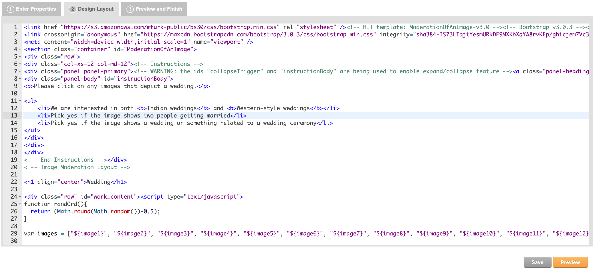

<!-- Check whether the assignment is up to date -->
{{'now' | date: '%Y'}}
{{page.due_date | date: '%Y'}}
 

Warning: this assignment is out of date.  It may still need to be updated for this year's class.  Check with your instructor before you start working on this assignment.


<!-- End of check whether the assignment is up to date -->

You should try to [sign up to be a Mechanical Turk Requester](https://requester.mturk.com/)  ASAP.  If you are unable to get an account, you can partner with a student who got one. 

This assignment is before {{ page.due_date | date: "%I:%M%p" }} due on {{ page.due_date | date: "%A, %B %-d, %Y" }}. 

Become a Requester : Assignment 5 
=============================================================

In this homework assignment, you're going to learn how to be a [requester on Amazon Mechanical Turk](https://requester.mturk.com/).  You should try to sign-up as a requester as soon as possible, because it is a multi-step process and each step can take time.  If you're unable to sign up as a requester yourself, we recommend partnering with another student who has successfully signed up. You will work in pairs.

Once you are a requester, you will be able to post work on MTurk and to pay workers to complete your tasks.  To complete the work outlined in this assignment, you need to pay about $25.  If paying $25 of your own money presents a financial hardship to you, then please email your professor.

We will be asking workers to label images for us, similar to how [Fei-Fei Li created ImageNet](https://qz.com/1034972/the-data-that-changed-the-direction-of-ai-research-and-possibly-the-world/).

In this assignment, you will ask workers to classify images on whether or not the image depicts a wedding. These images will be representative of both Western and Indian cultures. You will create three sets of HITs. The first HIT set will be a small task with 17 sample images and is intended to be completed as a tutorial on how to make a HIT. The other two HIT sets will be completed with a larger dataset of wedding images. The second HIT set will be completed by workers located in India and the third HIT set will be completed by workers located in the US. Your results from these two HIT sets will be used in the following HW5 assignment, in which you will train a classifier solely on the India-based results and another classifier solely on the US-based results. During HW5, you can observe the differences in the two classifiers. 

## Creating your first HIT set

Let's get started with creating your first HIT set on MTurk. Again, this HIT set is intended to be completed as a tutorial for students to learn how to correctly make HITs on Amazon Turk. After logging into your requester account, go to the Create Tab and then click [New Project](](https://requester.mturk.com/create/projects/new)).  We'll be labeling images, so you can start with the default Image Classification template (shown below).

Select Image Classification and then click on Create Project.  You will see 3 tabs: 
* **Enter Properties** is where you can configure how much you will pay workers to do your task (Reward per assignment), how many workers you want to annotate each item (Number of assignments per task), and who is allowed to work on your your tasks (Worker requirements).
* **Design Layout** is where you can edit the HTML that forms your HIT.  You can update the instructions,  add new HTML elements to collect input from workers, and modify the variable names (denoted as ${variable_name}).
* **Preview and Finish** is where you see how your task will look to workers.  When you publish your tasks, any variables in the layout will be replaced with the input data that you provide via a comma separated value (CSV) file.  You haven't uploaded any data yet and so you won't see it in the preview.

In the **Enter Properties** tab, you should change the following fields (you can leave the remaining fields unchanged):
* Project Name - this is a mneumonic name for yourself that is not displayed to workers. A relevant name is recommended, such as "Image labeling version 1".
* Title - this is what the workers will see in the HIT Groups listing on [worker.mturk.com](https://worker.mturk.com).  As workers will be labeling wedding photos, change this field to say "Does this image show a wedding?".
* Description - this is what a worker sees once they click on your HIT title. A recommended description is "Does this image depict a wedding?  We are interested in both Indian weddings and Western-style weddings."
* Keywords - workers can search for tasks based on this.  Add relevant keywords, such as *image*, *classification*, and *wedding*.
* Reward per assignment - this is how much workers will be paid to do one task. This reward doesn't include Amazon's commission. An example reward is $0.01.
* Number of assignments per task - this is how many workers you want to label each item. Set this to 3 so that a majority vote can be taken to classify an image in which workers disagree about what the correct answer should be.

In the **Worker requirements** section of the **Enter Properties** tab, add the following qualifications that workers have to meet in order to do the task:
* HIT Approval Rate >= 90%
* Number of HITs approved >= 500
* Location is "INDIA (IN)". A reminder – your second HIT will have the location set as "INDIA (IN)" and your third HIT will have the location set as "UNITED STATES (US)".

In the **Design Layout** tab, edit the HTML for the categories, header, and name. Additionally, edit the short-instructions and add full-instructions. Below is a screenshot with an example of instructions. Workers will be able to read these instructions to better understand what to do in the task.

After making those edits, click on Save and then Preview to see what your HIT will look like to workers.   Since you haven't yet uploaded any information (like the URLs for the images that you want workers to judge), there will be a placeholder saying "Image will display here".  

If you're satisfied with how the HIT looks, click the Finish button.  You'll then see your newly created task listed with a big orange button saying "Publish Batch" next to it.  You can publish a batch by clicking that button and uploading a comma separated value (CSV) file with the inputs to the HIT.  The popup screen that appears will give you a link to download a sample .csv file that shows what fields you need for your HIT.  For this HIT design, all we need is a single column with the header *image_url*, and a list of the image URLs that we want workers to judge.  Here's a [small CSV file](assignments/downloads/wedding-photos-small.csv) that you can use to test your HIT. Note: this is a sample .csv file that should be used only for this first tutorial HIT. You will use a larger .csv file containing all of the wedding photos in your other two HITs. This larger .csv file that you will create will have a different format as this sample .csv file, as explained in the instructions below. 

After uploading your .csv file, you can preview the HITs with the data populating them. There's a "Next HIT" button that will let you click through and preview multiple assignments. This is useful to confirm that your image links are all working properly.  

If you're happy with how the HITs look, click the big orange "Next" button at the bottom.  You'll then see a summary screen that gives details about the HIT including how much it will cost.  Publish your task for Turkers to work on by clicking on the big orange "Publish" button.

Your HITs will be posted to MTurk.  Once work has begun, you can monitor progress in the [Manage tab](https://requester.mturk.com/manage). You'll see a green progress bar showing how many of them have been completed. 

You can see the individual responses by clicking on the "Review Results" link above the progress bar.  On this screen you'll see:
* The HIT ID - notice that there are 3 HIT IDs that are all identical, since we asked 3 workers to annotate each item. 
* The Worker ID of the workers who completed each HIT.
* The Approval Rate for the worker - this is how many of the worker's tasks we have approved in the past (not how many all requesters have approved - just us).
* Input.Image Url - the input field in the CSV that we uploaded.
* Image Contains.Label - the label that the worker picked.

Notice that the three workers all said that the first URL did not show a wedding.  This is the image that they said doesn't show a wedding:

Three workers said that the second URL did show a wedding.  This is the image that does show a wedding:

The Review Results screen will let you approve or reject the Workers' submissions. It is recommended to automatically approve all the assignments for this first tutorial HIT.

You can download all of these results as a .csv file.  Here is the [results file](assignments/downloads/wedding-photos-small-Batch_3537650_batch_results.csv) from when Professor Callison-Burch created a test HIT with the 17 sample images. Note that the .csv file has many additional fields that include information about your HIT, such as the properties that you specified and information about the amount of time that workers took to complete each assignment. Columns in the results .csv that start with "Input." are the variables that were in the .csv file that you uploaded.  Columns that start with "Answer." are the answers that the Turkers provided.

## Why are we labeling images of Indian weddings?

This assignment is directly connected to HW5. In HW5, you will create classifiers trained on the images and labels you receive from your HITs. As one classifier will be trained solely on the US-based results and another classifier solely on the India-based results, it is expected that there will be differences between the two models. The goal of these two assignments is to highlight the ability for human bias and beliefs ingrained in the training data to influence the predictive nature of ML models, which can cause unintended and sometimes negative consequences.

[AI encodes and magnifies bias](https://www.fast.ai/2019/01/29/five-scary-things/#bias), and [Google researchers](https://ai.google/research/pubs/pub46553) found that ImageNet and another popular dataset called Open Images "appear to exhibit an observable amerocentric and eurocentric representation bias," as demonstrated by the distribution of geographically identifiable images in the datasets, with 2/3 of the images from the Western world.

In addition, classifiers trained on the datasets show "strong differences in the relative performance on images from different locales", with lower accuracy and confidence on images with labels related to people, like "bridegroom" and "police officer", from countries like India and China. The research helped inspire the [Inclusive Images Challenge](https://ai.googleblog.com/2018/09/introducing-inclusive-images-competition.html), run by Google in partnership with a top deep learning conference called NeurIPS, back in 2018.

A different large-scale crowdsourced dataset, [The Massively Multilingual Image Dataset (MMID)](http://multilingual-images.org/), was created by Penn researchers to learn English translations for words in 100 foreign languages by scraping images for each foreign word and finding the English words that had the most "similar" images.

MMID contains around 100 images for around 10,000 words in 100 foreign languages, providing an interesting source of data for improving the "geodiversity" of image classifiers. However, [the images for an English translation of a foreign word can be noisy](http://aclweb.org/anthology/P18-1239), as shown by crowdworkers who evaluated the relevance of images for a large subset of translations in 3 languages.

## What to do in this assignment

#### Detailed Instructions

  
1. Upload the [zipped "Weddings Indian Languages" dataset](https://nets213-hw5.s3.amazonaws.com/weddings-indian-languages.zip) to Colab and run `!unzip "weddings-indian-languages.zip"` in a new cell. The dataset is composed of around 200-1000 images per language, for 8 languages spoken in India (Bengali, Gujarati, Hindi, Malayalam, Marathi, Punjabi, Tamil, and Telugu), taken from MMID. Repeat with [the "Weddings European Language" dataset](https://nets213-hw5.s3.amazonaws.com/weddings-european-language.zip). You will submit the URL to this Colab notebook on Gradescope.
2. Create a single list of all image_url filepaths to the photos found in both datasets. We recommend using the [glob module](https://docs.python.org/3/library/glob.html) with the appropriate wildcards to get a list of all the images. The format of the filepaths must be the same as that found in the sample "wedding-photos-small.csv" input file used in your tutorial HIT set. For example, one image_url would look like: "https://s3.amazonaws.com/nets213-hw5/weddings-indian-languages/gujarati/7267/01.jpg". In other words, **you must add "https://s3.amazonaws.com/nets213-hw5/" to the beginning of each image file path**. Additionally, **shuffle all your rows**. You need to shuffle all your rows in a random fashion in order to randomize the images that the workers label. As it would be too costly to have all the images labeled, this randomization is necessary to get an even range of images.
3. In order for your input .csv file to work with the alternate HIT design (see step 4), it will have a different format than that found in the sample "wedding-photos-small.csv" input file you used in your tutorial HIT set. The goal of this step is to ultimately create a "input.csv" file with twelve columns labeled "image1", "image2", "image3", "image4", "image5", "image6", "image7", "image8", "image9", "image10", "image11", and "image12". The image_url filepaths should be evenly distributed among these twelve columns in your final input.csv file. It is recommended to do this step in Colab and then export as a .csv file. In your .csv file, only save a certain number of rows so that your second set of HITs only costs $12.50. Given the reward amount you specified, you can calculate out how many rows you need to save in your .csv file to make the total cost of these HITs equal $12.50.
4. We have created an alternate HIT design that lets workers label 12 images at a time (here's a [screenshot](images/requester-step-11.png)). Use the [HIT design that we provide](assignments/downloads/wedding-image-annotation-HIT-design-v2.txt) when designing your HITs by copying and pasting the code into your "Design Layout" section. 
5. Using this alternate HIT design found above, create your second set of HITs with the same settings as the first tutorial HIT set. This HIT set should also have a worker location property of "INDIA (IN)". This second HIT set will be completed by workers located in India. Confirm all your settings and publish your HITs. Again, this second HIT set should cost approximately $12.50. **Make sure to screenshot this page for the report**. 
6. Create your third HIT set with the same settings, but with the worker location property of "UNITED STATES (US)". This third HIT set will be completed by workers located in the US. Confirm all your settings and publish your HITs. Again, this third HIT set should cost approximately $12.50. **Make sure to screenshot this page for the report**. As your first tutorial HITs should cost approximately $1, second HITs as $12.50, and third HITs as $12.50, the total expense per team should be approximately $26.
7. After these two HIT sets are completed by workers, download the results into two separate .csv files. These two files will be submitted on Gradescope. 

#### Report

  
Below are the questions that you will be asked to answer about this assignment. Please turn in your answers in a PDF for Homework 4 on Gradescope.

1. What is the link to your Colab notebook?
2. Attach screenshots of the pages confirming the settings of your second HIT set (India-based workers) and third HIT set (US-based workers).
3. If you had more time to work on these HIT sets, what additional things would you add in the creation or processing of the HIT for better quality control and aggregation?
4. Calculate the cost of annotating images from the entire wedding dataset (Both Indian and European) on MTurk using the 1-image-per-HIT design that was described in the section “Your First HIT”. Compare this cost with the cost you obtained while using the multiple-images-per-HIT-design we gave you. Assume the “Reward per Assignment” in both the cases to be $0.01, and the “Number of Assignments per Task” to be 3. State any other assumptions necessary.
5. Calculate the cost of annotating the 35 million images in the MMID. For this question, you are free to choose any HIT design, and any values for “Reward per Assignment” and “Number of Assignments per task”.  State your reasons for choosing the design and these values. State any other assumptions necessary.
6. Next week you will use the results from your HITs to train classifiers. What differences could you expect between a classifier trained solely on the India-based worker labels and a classifier trained solely on the US-based worker labels?
7. Find a real life incident when bias within a model's training dataset caused unintended negative consequences. What were the consequences? Why did these unintended conseqences occur? What was the problem in the training dataset? What could have been done to prevent this incident from having occurred? 

