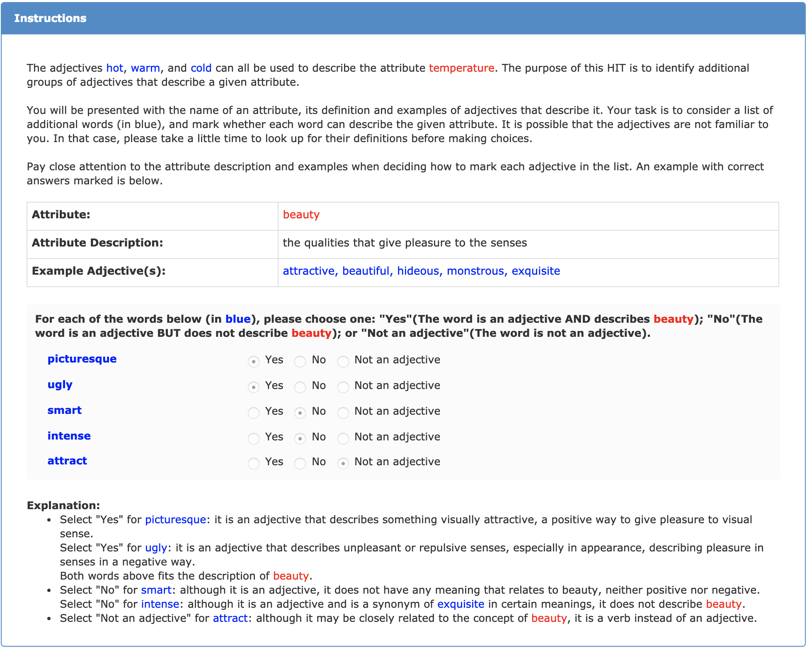
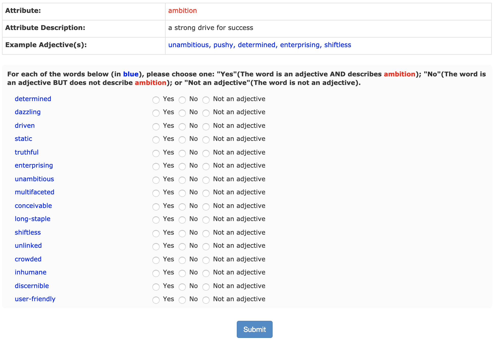

<!-- Check whether the assignment is up to date -->
{{'now' | date: '%Y'}}
{{page.due_date | date: '%Y'}}
 

Warning: this assignment is out of date.  It may still need to be updated for this year's class.  Check with your instructor before you start working on this assignment.


<!-- End of check whether the assignment is up to date -->

This assignment is before {{ page.due_date | date: "%I:%M%p" }} due on {{ page.due_date | date: "%A, %B %-d, %Y" }}. 

Quality Control: Assignment 7 
=============================================================
As you all may have noticed, it is easy to get a lot of junk answers from MTurk. 
You are hiring anonymous workers and you are paying them a few cents for their time. I don't know about you, but based on all of my cynical models of human behavior, I would absolutely expect that you get 100% crap results back. But the truth is, you don't. You get a lot of really legitimate work from a lot of very sincere workers, you just need to make some efforts to tease apart the good from the bad, which isn't always trivial. This is why we can dedicate a whole course to studying crowdsourcing.

So, this week, we will attempt to answer two big questions:

1. How good are my workers? Which workers are reliable and which ones appear to be incompetent, lazy, and/or inebriated?
2. How do I combine the (likely conflicting) labels from multiple workers in order to accurately label my data?

In class, we have discussed three different quality estimation methods to answer these questions:

1. Majority vote: A label is considered 'correct' if it agrees with the majority, and all votes are equal. (Pure democracy!)
2. Confidence-weighted vote: A label is considered 'correct' if it agrees with the majority, but all workers are not equal. A worker's weight is proportional to their accuracy on your embedded gold-standard questions. (Elitist republic!)
3. [Expectation maximization](http://en.wikipedia.org/wiki/Expectation%E2%80%93maximization_algorithm) : A label's 'correctness' is determined using an iterative algorithm, which uses the estimated quality of the worker in order to infer the labels, and then the estimated labels in order to infer the quality of the worker. (Some new-fangled solution to politics...?)

For this assignment, you will run the first two algorithms and provide a brief analysis comparing them to each other. Besides, you will filter out "good" workers and create a new qualification type of your own as another good way of quality control. The data you will be using are the results from a real mTurk project. You can work independently or in pairs.

Since EM is a more advanced algorithm, we will only require you to walk through a toy example.
If you are interested in machine learning, and want to understand this concept better, you are welcome and encouraged to run it on the same real mTurk project data and earn some extra credits!

Please first download the skeleton python file [homework7.py](assignments/hw7/homework7.py).

## Part 1: Aggregation methods

### Data

The data you will be using are the results from a real mTurk project **Adjectives and Attribute Matching** with a more complicated result file. You can download it as [hw7_data.csv](assignments/hw7/hw7_data.csv). These are real data collected for research purpose. 

Each HIT gives worker a certain attribute, its exact description, some example adjectives, and lets them judge for an additional several adjectives if each of them could describe that attribute. 

Below is a screenshot of the HIT instructions (same across all HITs) that worker can see. *To better understand this project, please take a close look at these instructions.*

And below is a screenshot of an example that worker would see and need to complete after the instruction. 

The content for each task changes according to the csv file uploaded to create the batch. 
To simplify things, we treat "Yes" as labeled `TRUE` while "No" or "No an adjective" both as labeled `FALSE`.
For each assignment, there are up to 16 number of adjectives for worker to label, where up to 10 are the ones we need answers, up to 5 for embedded positive quality control (the answer is supposed to be "Yes", i.e. `TRUE`), and 1 for negative quality control (the answer is supposed to be "No" or "Not an adjective", i.e. `FALSE`). Each assignment are supposed to be done by 3 workers, and those 16 words are shown in the random order for each worker.

In the data file, the fields with column names `Input.adj_*` are the 10 adjectives we need answers; `Input.pos_qual_ctrl_*` are the 5 for positive quality controls and `Input.neg_qual_ctrl` is the 1 for negative quality control. The columns that in the same format with `Input` replaced to `Answer` are the answers we got from workers. For all the function return values and output files in this assignment, you should only contain relevant things for the words in the `Input.adj_*` columns, ignoring the embedded quality control columns.

### Majority vote

Majority vote is probably the easiest and most common way to aggregate your workers' labels. It is simple and gets to the heart of what "the wisdom of crowds" is supposed to give us - as long as the workers make uncorrelated errors, we should be able to walk away with decent results. Plus, as every insecure middle schooler knows, what is popular is always right. 

1. First, use majority vote to assign labels to each of the attribute-adjective pair in the data. You will implement a function `majority_vote(rows)` that takes in the initial list of result rows (no column names) read from the result CSV file we give, return a list of three-element tuples in the format `(attr_id, adj, label)` sorted increasingly given the same column order.

	Lets let $$p$$ be a attribute-adjective pair and we'll use $$\textit{labels}$$ to refer to the data structure we are building, so that $$\textit{labels}[p]$$ is the label we assign to $$p$$. So we have 

	
$$\textit{labels}[p] = \text{majority label for } p.$$

	In your `main` function, you should output the returned tuples into a 3-column CSV file called `output1.csv` with the same column names mentioned above.

2. Now, you can use the pair labels you just computed to estimate a confidence in (or quality for) each worker. We will say that a worker's quality is simply the proportion of times that that worker agrees with the majority. 

	Let's define some more notation. This is, after all, a CS class. We have a quota to meet for overly-mathifying very simple concepts, to give the appearance of principle and rigor. 

	Lets call $$\textit{qualities}$$ the dictionary that we build to hold the quality of each worker. We'll call the $$i$$th worker $$w_i$$ and we'll use  $$\textit{pairs}[w_i]$$ to represent all the attribute-adjective pairs for which $$w_i$$ provided a label. We'll let $$l_{pi}$$ represent the label, i.e. `TRUE` or `FALSE`, that $$w_i$$ assigns to the pair $$p$$. Then we calculate the quality of a worker as:

	

		$$\textit{qualities}[w_i] = 
		\frac{1}{|\textit{pairs}[w_i]|} \cdot
		\sum_{p\in \textit{pairs}[w_i]} 
		\delta(l_{pi}\textit{ == labels}[p]).$$
	

	Here, $$\delta(x)$$ is a special function which equals 1 if $$x$$ is true, and 0 if $$x$$ is false. 

	You will implement a function `majority_vote_workers(rows, votes)` that takes in the initial list of result rows (no column names) read from the result CSV file we give and the votes computed from the previous question, return a list of two-element tuples in the format `(worker_id, quality)` sorted increasingly given the worker_id.

	In your `main` function, you should output the returned tuples into a 2-column CSV file called `output2.csv` with the same column names mentioned above.

    
### Weighted majority vote

Majority vote is great: easy, straightforward, fair. But should everyone really pull the same weight? As every insecure student knows, whatever the smartest kid says is always right. So maybe we should recalibrate our voting, so that we listen more to the better workers. 

3. For this, we will use the embedded quality control test questions. We will calculate each worker's quality to be their accuracy on the test questions. E.g.  

	

		$$\textit{qualities}[w_i] = 
		\frac{1}{|\textit{gold_pairs}[w_i]|} \cdot
		\sum_{p\in \textit{gold_pairs}[w_i]} 
		\delta(l_{pi}\textit{ == gold_labels}[p]).$$
	

	Remember, you can know whether or not an attribute-adjective pair in your CSV file corresponds to a gold test question by checking the `*_qual_ctrl*` columns.

	You will implement a function `weighted_majority_vote_workers(rows)` that takes in the initial list of result rows (no column names) read from the result CSV file we give, return a list of two-element tuples in the format `(worker_id, quality)` sorted increasingly given the worker_id.

	In your `main` function, you should output the returned tuples into a 2-column CSV file called `output3.csv` with the same column names mentioned above. 

4. You can use these worker qualities to estimate new labels for each of the attribute-adjective pairs in the data. Now, instead of a every worker getting a vote of 1, each worker's vote will be equal to their quality score. So we can tally the votes as 

	

		$$\textit{vote}[p][l] = 
		\sum_{w_i \in \textit{workers}[p]} 
		\delta(l_{pi}\textit{ == }l)\cdot \textit{qualities}[w_i]$$
	

	where $$\textit{vote}[p][l]$$ is the weighted votes for assigning label $$l$$ to attribute-adjective pair $$p$$ and $$\textit{workers}[p]$$ is just lists all of the workers who labeled $$p$$. Then 

	
$$\textit{labels}[p] = l \text{ with max } \textit{vote}[p][l].$$

	You will implement a function `weighted_majority_vote(rows, workers)` that takes in the initial list of result rows (no column names) read from the result CSV file we give and and the worker quality computed from the previous question, return a list of three-element tuples in the format `(attr_id, adj, label)` sorted increasingly given the same column order.

	In your `main` function, you should output the returned tuples into a 2-column CSV file called `output4.csv` with the same column names mentioned above. 

## Part 2: The EM algorithm

The data aggregation algorithms you used above were straightforward and work reasonably well. But they are of course not perfect, and with all the CS researchers out there, all the Ph.Ds that need to be awarded and all the tenure that needs to be got, its only natural that many fancier, mathier algorithms have arisen. 

We discussed the expectation maximization (EM) algorithm in class as a way to jointly find the data labels <i>and</i> the worker qualities. The intution is "<i>If</i> I knew how good my workers were, I could easily compute the data labels (just like you did in step 2 of weigthed vote) and <i>if</i> I knew the data labels, I could easily compute how good my workers are (just like you did in step 1 of weighted vote). The problem is, I don't know either." So the EM solution is to guess the worker qualities, use that to compute the labels, then use the labels we just computed to reassign the worker qualities, then use the new worker qualities to recompute the labels, and so on until we converge (or get bored). This is one of the best-loved algorithms in machine learning, and often appears to be somewhat magic when you first see it. The best way to get an intuition about what is happening is to walk through it by hand. So for this step, we will ask you do walk through 3 iterations of EM on a [toy data set](assignments/downloads/em_toy_data.txt).

You will implement a function `em_vote(rows, iter_num)` that takes in the list of result rows read from the toy dataset, return a list of two-element tuples in the format `(url, label)` sorted increasingly by the url order. Some skeleton functions are given, which should help with your understanding of the algorithm structure.

In your `main` function, you should output the returned tuples into a 2-column CSV file called `output5.csv` with the same column names mentioned above. 

You can refer to the [lecture slides](slides/quality-control-3.pdf) as a guide. The numbers are slightly different, but the process is idenitcal. If you are super ambitious, you are welcome to delve into the depths of the [original 1979 paper](http://crowdsourcing-class.org/readings/downloads/ml/EM.pdf) describing the use of EM for diagnosing patients. If you are super ambitious and/or super in want of extra credit, you can code it up and run EM on the data on the Adjectives and Attribute Matching result data!

## Part 3: Qualified workers

Sometimes, the projects you need for crowd-sourcing might needs better understanding or attention from people, or requires tons of data for people to label with limited budget. In that case, you might not want risk having people that are totally random, but the ones who actually gets what you are trying to do.

The Adjectives and Attribute Matching project we are dealing with in this assignment fits perfectly to those conditions. So we decided to go with this other quality control method, which is to use a test batch to select "good" workers that can do our tasks with high quality in general and only allow them to be the workers for our full batch data. The data you have access to in this assignment is actually a test batch that we use to do the selection. 

How do we define as "good" workers? In our case, we need a worker to satisfy 3 conditions:
1. Completed >= 5 number of HITs;
2. Must be correct about the negative quality control adjective;
3. Must reach >= 75% correctness about the positive quality control adjectives.

You can of course try other criterions and see how things are different if you are interested and discuss in the report, but not for python code submission purpose.

You will implement a function `select_qualified_worker(rows)` that takes in the initial list of result rows (no column names) read from the result CSV file we give, return a list of two-element tuples in the format `(worker_id, pos_percentage)` sorted increasingly by the worker\_id. 

In your `main` function, you should output the returned tuples into a 2-column CSV file called `output6.csv` with the same column names mentioned above. 

Additionally, create a new qualification type and add the "good" workers to it according to your results. You can access a worker's page by going to **https://requester.mturk.com/workers/WORKERID**. Take a screenshot when you are done adding all the qualified workers.

#### Deliverables

1. **homework7.py** with your own codes added
	
	Notice: Please **DON'T** put any print statements inside or outside any functions. Otherwise, you may lose all points for your python implementation. If you need to print anything for debugging for analyzing, please do that in your `main` function.

2. All 6 required output CSV files from **output1.csv** to **output6.csv**

3. Report **homework7.pdf**
 * Compare 2 method results from Part 1, give interesting examples on how they are different on some example attribute-adjective pairs
 * Worker quality and URL labels after each iteration of EM algorithm for toy dataset
 * Screenshot of your own new qualification type with "good" workers added
 * Share your thoughts on different quality control methods

<h4>Grading Rubric</h4>

This assignment is worth 5 points of your overall grade in the course. The rubric for the assignment is given below.

* 1 point - Python file with required functions implemented. Your code should be readable enough that we can tell what you did, but does not need to conform to any particular interface.
* 2 point - 6 ouput CSV files in the required format.
* 2 point - Report with required details.
* Extra credit (1 point) - an extra Python file and CSV results with your EM implementation on our data.

